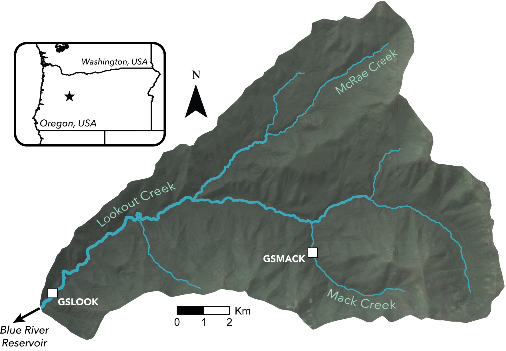
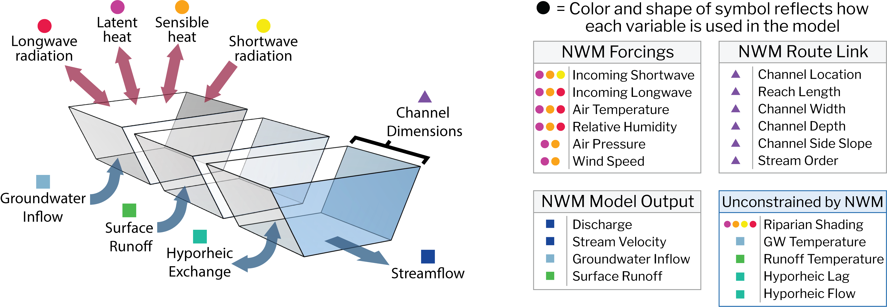
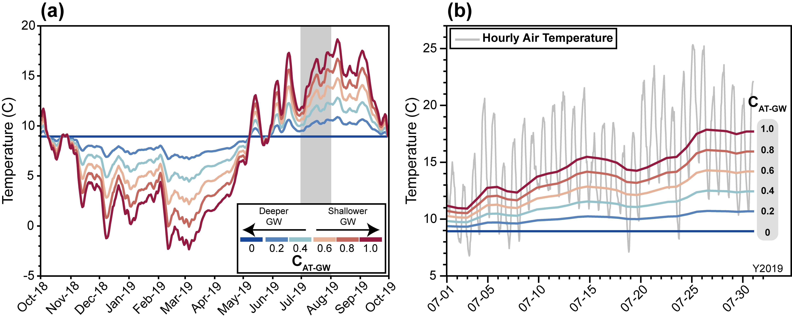
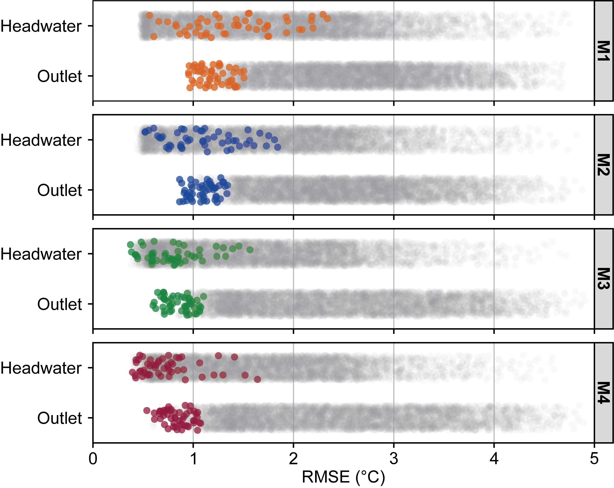
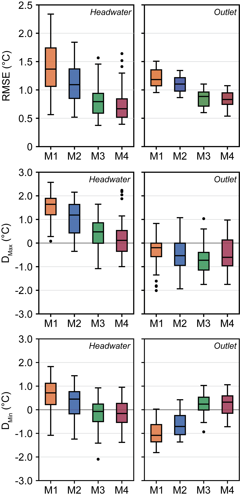
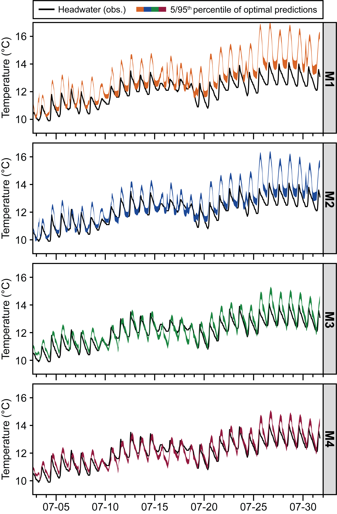
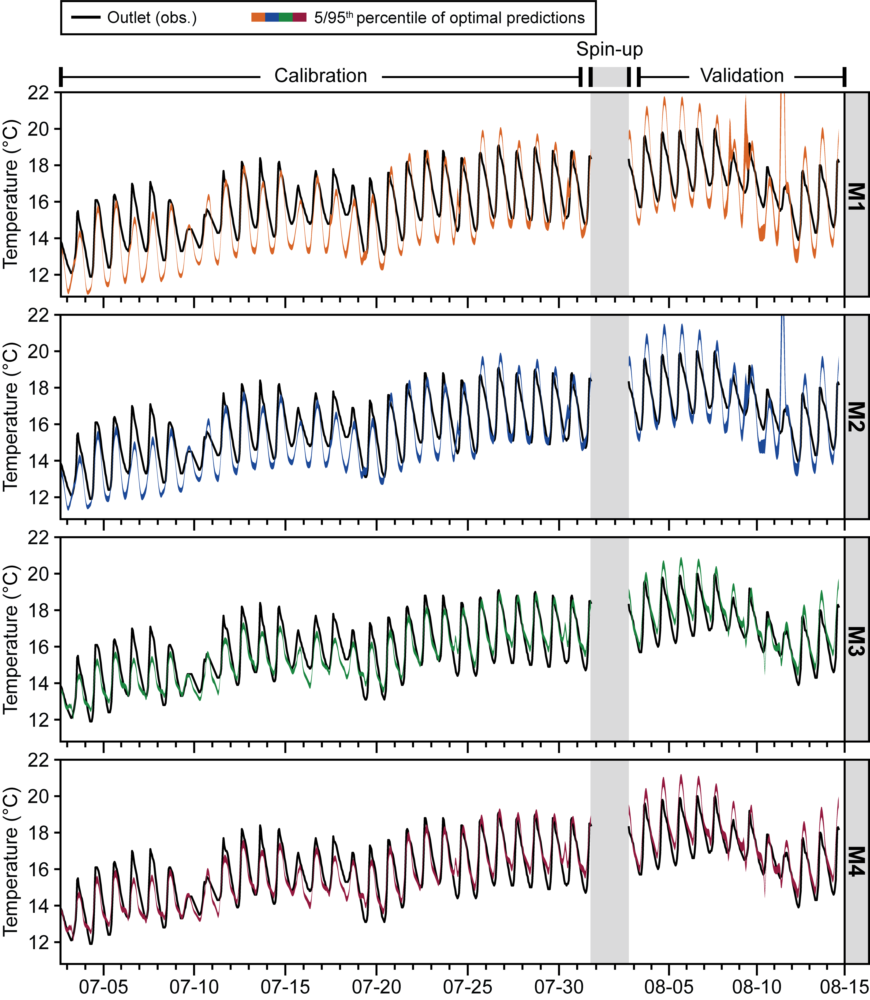
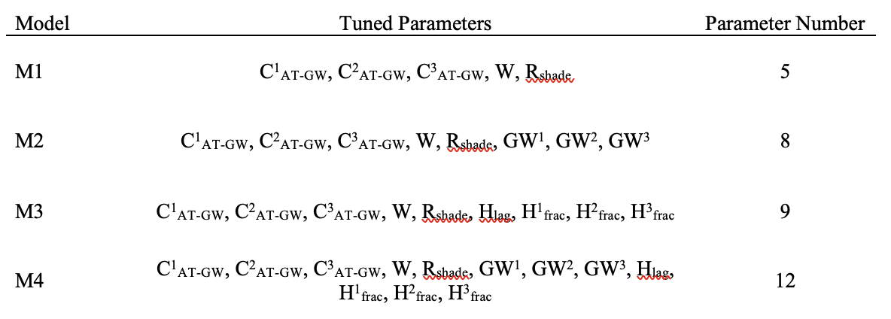
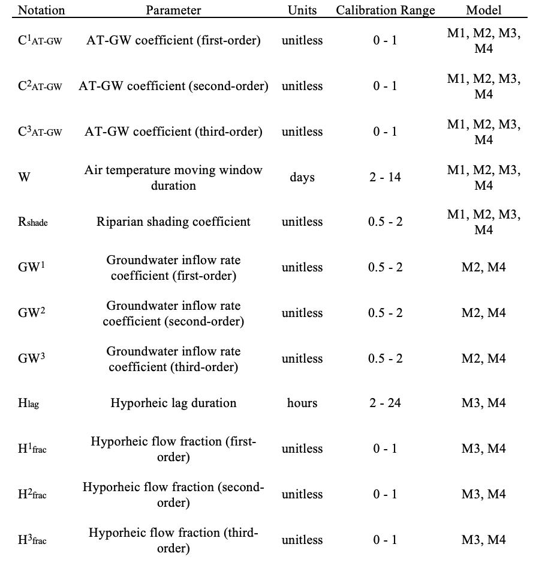
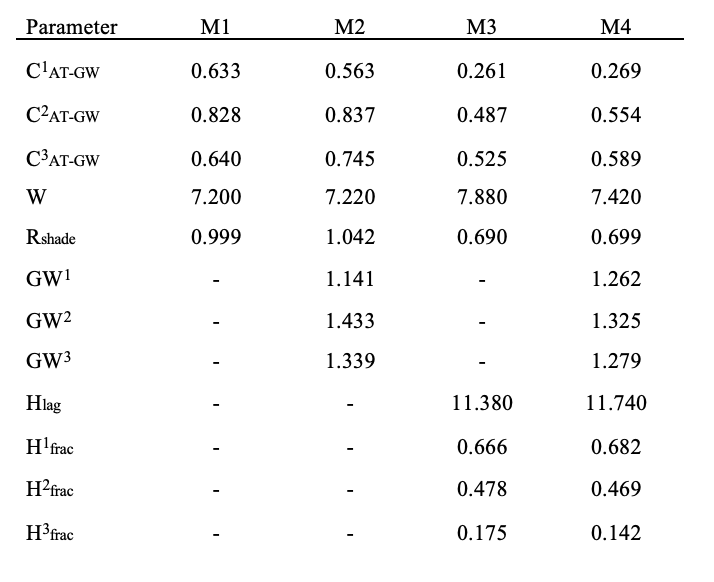

# Deterministic modeling of river water temperatures within the National Water Model Framework.

The water temperature of global river networks is an influential control on numerous aspects of water quality and riverine ecology, impacting rates of solute processing, dissolved oxygen content, and habitat viability for aquatic ecosystems. At present, few models exist to predict water temperatures at both a broad spatial extent and at a high spatial (kilometer-scale) and temporal (hourly) resolution. The National Water Model (NWM), a continental-scale (USA) hydrologic model based on WRF-Hydro and implemented by NOAA and NCAR, presents a potential framework for developing a spatially and temporally continuous coupled river temperature model. Leveraging forcings, parameters, and model outputs from the NWM v2.1 Retrospective dataset, we developed a deterministic semi-Lagrangian modeling framework (based on Yearsley, 2009) to predict hourly water temperatures along 35 kilometers of NWM river reaches in a single test basin (H.J. Andrews Experimental Forest) during July 2019. By sequentially calibrating and validating model configurations of increasing complexity, we achieved predictions with RMSE values under 0.6&deg;C. Our results demonstrate the potential capabilities of a NWM-coupled water temperature model, while also highlighting key areas for future research and development.

All scripts are written in Python. File references are relative to the GitHub repository main folder and should be changed to match your local directory. Additional information on each step of our analysis is available within individual repository folders.

## Contents

-   **/data_formatting**: Downloads, extracts, and formats NWM v2.1 Retrospective data at H.J. Andrews Experimental Forest study catchment.

-   **/model_calibration**: Results from Monte Carlo calibration of four model configurations.

-   **/model_validation**: Results from valdation of top calibrated runs.

-   **/presentations**: In-depth presentation on motivations, model development, and future outlook for NWM water temperature modeling.

-   **/python_environment**: Yml file used to generate Python environment for model scripts.

-   **/visualization**: Figures and tables illustrating modeling outcomes.

-   **/water_temp_model**: Main water temperature modeling and calibration scripts.

## Procedure

1.  Create and activate Python environment using **/python_environment/nwm_st_env.yml**.

2.  Download and format model input data using scripts in **./data_formatting**. These include:
    -   **/nwm_channels/nwm_channel_download.py**: Retrieves channel parameters for reaches in test catchment.
    -   **/nwm_retrospective/nwm_retrospective_download:py**: Downloads and extracts NWM v2.1 Retrospective forcings and model outputs at model reaches.
    -   **/riparian_shading/rip_shading_VSI.py**: Estimates riparian shading using gridded vegetation data and a vegetation shading algorithm developed by Kalny et al., 2017.
    -   **/site_data/hja_at_download.py**: Downloads PRISM air temperature data used to estimate groundwater temperatures.
    
3.  Calibrate water temperature model configurations using scripts in **/water_temp_model**. These include:
    -   **nwm_st_model_base.py**: Main model function called during calibration loops.
    -   **nwm_st_model_cal_runs.py**: Calibrates four model configurations using Monte Carlo parameter sampling.
    -   **nwm_st_model_val_runs.py**: Validates four model configurations using top calibrated parameter sets.
    
4.  Results of calibration, including error metrics and water temperature predictions, are saved to **/model_calibration**.

5.  Results of validation, including error metrics and water temperature predictions, are saved to **/model_validation**.

5.  Visualize outcomes of model calibration using scripts in **/visualization**. These include:
    -   **nwm_st_visualization**: Generates figures related to model predictions and error.
    -   **gw_temp_visualization**: Generates figures related to groundwater inflow temperatures.
    

## Highlights

### Model Test Catchment: H.J. Andrews Experimental Forest, OR, USA

**Figure 1.** Location of water temperature gages (‘Headwater’: GSMACK, ‘Outlet’: GSLOOK) with the H.J. Andrews Experimental Forest watershed in relation to channels identified by the National Water Model.

 

### Modeled Heat Fluxes and Associated NWM Inputs

**Figure 2.** Primary atmospheric, radiative, and hydrologic heat fluxes represented in the water temperature model. Model data sources fall into four broad categories: NWM gridded forcings, NWM model outputs, NWM channel route link files, and external data unconstrained by the NWM. The color and shape of symbology indicates how each variable contributes to calculated heat fluxes in the model.
 
 
 
### Estimating Groundwater Inflow Temperatures

**Figure 3.** Estimated groundwater inflow temperatures for (a) WY2019 and (b) July 2019 study period at the headwaters of Mack Creek for a range of *CAT-GW* (air temperature scaling coefficient) values. Values of *CAT-GW*, closer to 0 represent relatively deeper sourcing depths while values of *CAT-GW* closer to 1 represent relatively shallower sourcing depths.
 
  
 
### Prediction Quality of Model Configurations

**Figure 4.** Simulated water temperature prediction RMSE (°C) at headwater (Mack Creek) and outlet (Lookout Creek) gages. For the calibration (Cal.) of each model configuration, the top 1% of runs, ranked by RMSEw (weighted headwater (25%) and outlet (75%) RMSE), are highlighted as colored points amongst all calibration runs (represented by gray points). The validation (Val.) performance of the top 1% of calibrated parameter sets is represented by colored triangles.

 

### Model Performance Across Error Metrics

**Figure 5.** Performance of four model configurations at the headwater (Mack Creek) and outlet (Lookout Creek) gages, evaluated across three metrics of model error (RMSE: root mean square error; DMax: daily maxima error; DMin: daily minima error). Paired boxplots show error metrics during calibration (left) and validation (right) periods for each configuration. Error metrics calculated using parameter sets from the top 1% of calibration runs, ranked by RMSEw (weighted headwater (25%) and outlet (75%) RMSE).

 

### Water Temperature Prediction Envelopes at Headwater Gage

**Figure 6.** Observed headwater temperatures (black) and 5/95th confidence envelope of water temperature predictions at the headwater gage across model configurations M1, M2, M3, and M4 for the top 50 calibration runs (1st percentile), ranked by weighted headwater and outlet RMSE (RMSEw). Predictions displayed during a four-week calibration period and a two-week validation period, separated by a 48-hour spin-up period for validation.
 

### Water Temperature Prediction Envelopes at Outlet Gage

**Figure 7.** Observed outlet temperatures (black) and 5/95th confidence envelope of water temperature predictions at the outlet gage across model configurations M1, M2, M3, and M4 for the top 50 calibration runs (1st percentile), ranked by weighted headwater and outlet RMSE (RMSEw). Predictions displayed during a four-week calibration period and a two-week validation period, separated by a 48-hour spin-up period for validation.

 

### Water Temperature Model Configurations

**Table 1.** Water temperature model formulations, tuned parameters, and number of parameters.

 

### Calibrated Parameter Definitions and Ranges

**Table 2.** Definitions and ranges of parameters used in Monte Carlo tuning of models M1-M4.

 

### Optimal Parameter Values for Calibrated Runs

**Table 3.** Optimal mean parameter values for the top 50 calibration runs of each model (M1-M4), ranked by RMSEw.

 
