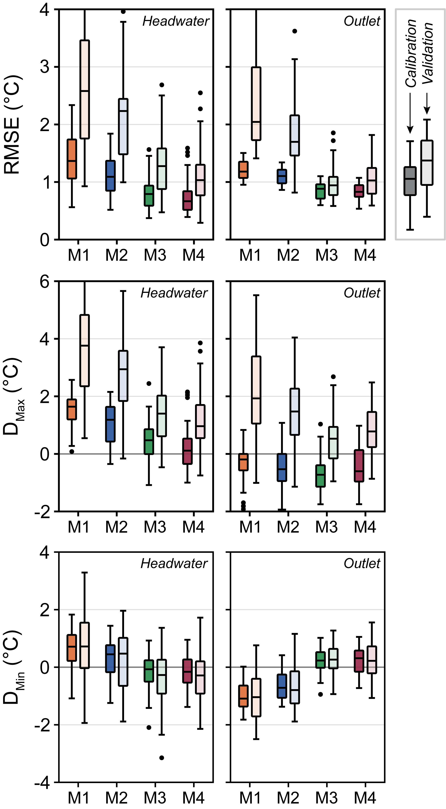
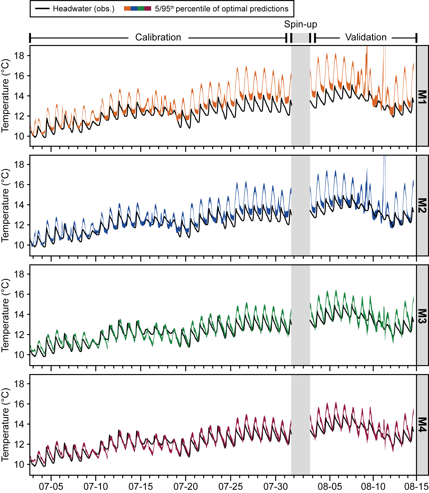
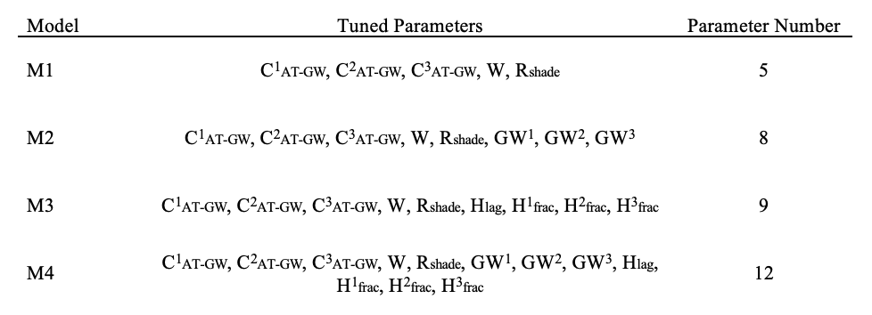

# Deterministic modeling of river water temperatures within the National Water Model Framework.

The water temperature of global river networks is an influential control on numerous aspects of water quality and riverine ecology, impacting rates of solute processing, dissolved oxygen content, and habitat viability for aquatic ecosystems. At present, few models exist to predict water temperatures at both a broad spatial extent and at a high spatial (kilometer-scale) and temporal (hourly) resolution. The National Water Model (NWM), a continental-scale (USA) hydrologic model based on WRF-Hydro and implemented by NOAA and NCAR, presents a potential framework for developing a spatially and temporally continuous coupled river temperature model. Leveraging NWM forcings, parameters, and model outputs, we developed a deterministic modeling framework to predict hourly water temperatures along NWM reaches in a single test basin (H.J. Andrews Experimental Forest). By sequentially calibrating and evaluating model configurations of increasing complexity, we achieved predictions with RMSE values under 0.6 degrees C. Our results demonstrate the potential capabilities of a NWM-coupled water temperature model, while also highlighting key areas for future research and development.

All scripts are written in Python. File references are relative to the GitHub repository main folder and should be changed to match your local directory. Additional information on each step of our analysis is available within individual repository folders.

## Highlights

### Model Test Catchment: H.J. Andrews Experimental Forest, OR, USA

**Figure 1.** Location of water temperature gages (‘Headwater’: GSMACK, ‘Outlet’: GSLOOK) with the H.J. Andrews Experimental Forest watershed in relation to channels identified by the National Water Model.

### Modeled Heat Fluxes and Associated NWM Inputs

**Figure 2.** Primary atmospheric, radiative, and hydrologic heat fluxes represented in the water temperature model. Model data sources fall into four broad categories: NWM gridded forcings, NWM model outputs, NWM channel route link files, and external data unconstrained by the NWM. The color and shape of symbology indicates how each variable contributes to calculated heat fluxes in the model.
 
 
 
### Approach to Estimating Groundwater Inflow Temperatures

**Figure 3.** Estimated groundwater inflow temperatures for (a) WY2019 and (b) July 2019 study period at the headwaters of Mack Creek for a range of *CAT-GW* (air temperature scaling coefficient) values. Values of *CAT-GW*, closer to 0 represent relatively deeper sourcing depths while values of *CAT-GW* closer to 1 represent relatively shallower sourcing depths.
 
 
 
### Prediction RMSE Across Model Configurations

**Figure 4.** Simulated water temperature RMSE at headwater (Mack Creek) and outlet (Lookout Creek) gages for 5,000 Monte Carlo calibration runs of each model configuration (gray). Top 50 (1st percentile) runs of each model configuration, ranked by weighted RMSE (weighted headwater (25%) and outlet (75%) RMSE), are highlighted.

### Model Performance Across Error Metrics

**Figure 5.** Performance of four model configurations at the headwater (Mack Creek) and outlet (Lookout Creek) gages, evaluated across three metrics of model error (RMSE: root mean square error; DMax: daily maxima error; DMin: daily minima error). Error metrics calculated using top 50 runs (1st percentile) ranked by weighted headwater and outlet RMSE for each configuration.

### Water Temperature Prediction Envelopes at Headwater Gage

**Figure 6.** Observed headwater temperatures (black) and 5/95th confidence envelope of water temperature predictions at the headwater gage across model configurations M1, M2, M3, and M4 for the top 50 runs (1st percentile) ranked by weighted headwater and outlet RMSE.

### Water Temperature Prediction Envelopes at Outlet Gage

**Figure 7.** Observed headwater temperatures (black) and 5/95th confidence envelope of water temperature predictions at the outlet gage across model configurations M1, M2, M3, and M4 for the top 50 runs (1st percentile) ranked by weighted headwater and outlet RMSE.

### Water Temperature Model Forulations

**Table 1.** Water temperature model formulations, tuned parameters, and number of parameters.

### Calibrated Parameter Definitions and Ranges

**Table 2.** Definitions and ranges of parameters used in Monte Carlo tuning of models M1-M4.

### Optimal Parameter Values for Calibrated Runs

**Table 3.** Optimal mean parameter values for top 50 runs of each model (M1-M4).

## Contents

-   **./nwm_data_download**: Download and extract NWM v2.1 Retrospective data at H.J. Andrews Experimental Forest study catchment

-

Model Environment/YAML?

## Procedure

To recreate our analysis, heed the following instructions:

1.  Run **GAGES_StreamTemp_Sites.R** in **./site_id** to identify sites used in the analysis.

2.  Within **./data_download**, run the following scripts:

    -   **./AirTemperature**: **PRISM_data_formatting.R** to extract daily air temperature at each site.

    -   **./Discharge**: **Discharge_DataDownload.R** to download daily USGS discharge data at each site.

    -   **./StreamTemperature**: **ST_DataDownload.R** to download daily USGS ST data at each site.

3.  Run **max_calc.R** and **thermal_sensitivity_calc.R** in **./metric_calculation** to calculate ST metrics. *(Note: Thermal Sensitivity and Slope are used interchangeably in this repository)*

4.  View **./StratifiedSampling** in **./site_classification** to confirm manual-determined stratified sampling groups.

5.  Run **RF_runs_hyperparameter_tuning.R** in **./rf_model_tuning** to optimize *mtry* in RF models.

6.  Run **RF_runs.R and RF_pred_runs.R** *in* **./model_runs** to fit monthly RF models to different combinations of metrics and sites.

7.  Perform Spearman's rank correlation between predictors and metrics using **RF_spearman.R** scripts in **./spearman**.

8.  Generate final figures using **RF_vis_run.R** in **./visualization**. *(Note: Many figures were altered for publication using Adobe Illustrator. Where applicable, Illustrator files are included.)*
